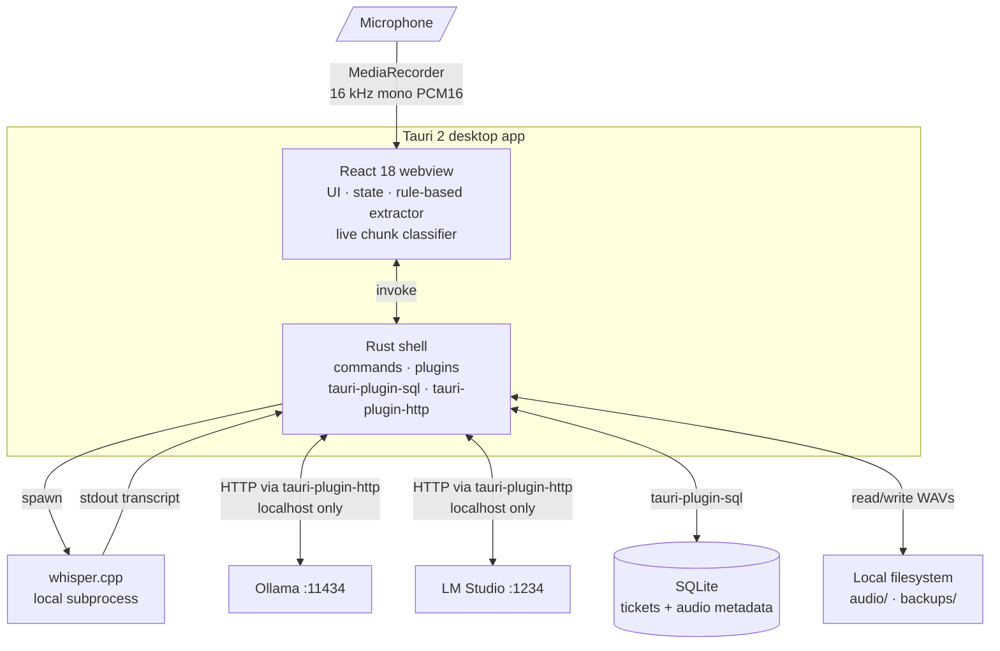

# Store Ticket Assistant


> A desktop app that turns retail POS support calls into pre-filled ticket forms. **100% local** — whisper.cpp + Tauri + React. No cloud, no API keys, no telemetry.

---

## Table of contents

- [Project overview](#project-overview)
- [Demo](#demo)
- [Why I built it](#why-i-built-it)
- [Architecture](#architecture)
- [Tech stack](#tech-stack)
- [Engineering challenges solved](#engineering-challenges-solved)
- [Setup](#setup)
- [Workflow](#workflow)
- [User modes](#user-modes)
- [Privacy & data](#privacy--data)
- [Testing](#testing)
- [What I learned](#what-i-learned)
- [Roadmap](#roadmap)
- [License](#license)

---

## Project overview

I support **~1,100 retail stores** across the US from Egypt. Every support call ends the same way: I open ManageEngine, type the store number, the caller, the issue, the troubleshooting steps, the resolution, the category, sub-category, item, transaction number, payment type — and then start the next call. The mechanical part of ticketing was eating 30–40% of my call-handling time, and call notes were scattered across notepads I couldn't search.

**Store Ticket Assistant** is the tool I built to fix that. It records the call (or accepts a pasted transcript), transcribes it locally with whisper.cpp, extracts every ticket field the system asks for, and lets me copy each field into ManageEngine with one click. The original transcript is preserved alongside the structured fields, the recording is attached to the ticket, and the whole history is searchable.

The app is intentionally local-first. Calls contain customer transaction numbers, store identifiers, and occasionally PII — none of which should ride over a cloud transcription API or be subject to a third-party's data-retention policy. Every transcription, every extraction, every LLM inference happens on the technician's machine.

## Demo

> Drop a `00-demo.gif` (≤ 5 MB, 12 fps recommended) at `docs/screenshots/00-demo.gif` and it will render below.

<p align="center">
  
</p>

### Key screens

<table>
  <tr>
    <td align="center" width="50%">
      
      <br /><em>Home — Daily Mode (clean sidebar)</em>
    </td>
    <td align="center" width="50%">
      
      <br /><em>New Ticket — recording in progress</em>
    </td>
  </tr>
  <tr>
    <td align="center">
      
      <br /><em>Live Conversation with Q→A turn-taking</em>
    </td>
    <td align="center">
      
      <br /><em>Ticket Form Helper with copy-ready fields</em>
    </td>
  </tr>
  <tr>
    <td align="center">
      
      <br /><em>Copy Mode — field-by-field walkthrough</em>
    </td>
    <td align="center">
      
      <br /><em>Settings — Daily Mode (3 tabs)</em>
    </td>
  </tr>
</table>

> Screenshot capture instructions are in [`docs/screenshots/README.md`](docs/screenshots/README.md).

## Why I built it

Three motivating constraints:

1. **Latency is the enemy of ticket quality.** When a call ends and I have to type 15 fields from memory, I trim the details. Voice-first capture means the transcript exists *before* I start typing — I'm editing rather than recalling.
2. **Cloud transcription is a non-starter.** The calls reference customer transaction numbers, internal store identifiers, and occasionally cardholder context. Sending them to a third-party API is a compliance fight I don't want and a dependency I don't trust.
3. **Latency on a 7,000 km link.** I'm in Egypt; the cloud transcription services with reasonable accuracy are US/EU-hosted. Even a 200 ms round-trip per chunk adds up when transcribing a 5-minute call in near-real-time.

Local-first solves all three. **whisper.cpp** runs on my MacBook, **SQLite** persists tickets next to the app, and the optional LLM (Ollama or LM Studio) runs on the same machine. Nothing leaves the laptop unless I explicitly export a backup.

## Architecture



**The boundary:** Rust handles anything stateful or side-effecting — filesystem reads/writes, spawning whisper.cpp, talking to localhost LLM servers, SQLite queries. The React webview handles UI, app state (Zustand), the rule-based field extractor, and the live chunk classifier (which is pure text + audio-stat logic, deterministic, fast).

**Why this split:** keeping the rule-based extractor in TypeScript means I can write Vitest unit tests against it without spinning up Tauri. Keeping process spawn and filesystem in Rust means there's zero Node runtime in production — the Tauri webview is a thin native shell.

## Tech stack

| Layer | What I used |
| --- | --- |
| **Desktop shell** | Tauri 2 + Rust 1.77+ |
| **UI** | React 18, TypeScript 5, Vite 6, Tailwind CSS, Zustand |
| **Routing** | React Router 6 |
| **Storage** | SQLite via `tauri-plugin-sql`, localStorage shadow for settings |
| **Transcription** | whisper.cpp (installed separately, called as subprocess) |
| **Optional LLM** | Ollama (default `llama3.1:8b`) or LM Studio (OpenAI-compatible local API) |
| **Audio capture** | `MediaRecorder` + `OfflineAudioContext` (16 kHz mono PCM16 WAV) |
| **Audio metering** | Web Audio `AnalyserNode` for peak/RMS levels |
| **Testing** | Vitest (24 test files / 277 tests), plus two custom regression suites (analyzer, writing) |
| **Build** | `npm run tauri:build` → `.app` + `.dmg` (macOS), `.msi` (Windows), `.deb`/`.AppImage` (Linux) |

## Engineering challenges solved

The substantive problems I had to design around, not just code through.

### 1. whisper.cpp hallucinates on silence

whisper reliably outputs **"Thank you for watching"** or **"[ Pause ]"** or **"Subtitles by..."** when fed silent or near-silent audio. Naively rendering those chunks into the conversation view made the transcript unusable for any quiet stretch of a call.

**Solution:** a live chunk text classifier (`src/services/liveAudioTextFilter.ts`) that runs after whisper and classifies each chunk into `speech / silence / noise / unclear / hallucination` using:
- A stock-phrase blocklist for known hallucinations
- Bracket-artifact stripping (`[inaudible]`, `[ Pause ]`, `*music*`)
- Audio RMS + peak levels (per-mic calibrated thresholds)
- Generic-response detection ("Okay", "Yeah") gated by audio level

Hallucinated chunks stay in the raw debug log (so the user can see what whisper actually said) but are flagged `shouldShowInConversation: false`. The conversation view renders only `speech` chunks. 21 dedicated tests cover the classifier.

### 2. ASR mishears domain vocabulary

whisper hears "calm services" for "COM services", "in see go" for Inseego, "register one" for Register 1, "very phone" for VeriFone. Left uncorrected, the analyzer can't match any of these to a ticket category.

**Solution:** an editable correction dictionary with reversible auto-apply per rule. Every correction surfaces in the UI as `↺ "calm services" → "COM services"` so the technician can audit (or undo) any rewrite. Number-word normalization is a separate pass ("register one" → "Register 1"). Both passes are turned off in Settings if the technician trusts whisper's output verbatim.

### 3. Browser `fetch` can't reach Ollama because of CORS

The webview calling `localhost:11434` triggers CORS preflight failures because Ollama serves an unrestricted `Origin` header. Asking every user to restart Ollama with `OLLAMA_ORIGINS='*'` is not a real solution.

**Solution:** route HTTP through `tauri-plugin-http`. The Rust side makes the request with no CORS in play — the webview gets the response back as a plain JSON value. The exact same code in `npm run dev` (Vite-only) does fall back to browser `fetch` and shows the CORS workaround, but Tauri builds Just Work.

### 4. Speaker detection without a diarization model

Phone calls have two speakers (technician + caller) that I need to label in the live transcript. Real diarization models (pyannote, NeMo) are 100+ MB, slow, and need labeled training data.

**Solution:** rule-based Q→A turn-taking. Classify each utterance into `tech intake question` / `caller answer` / `tech diagnostic question` based on text patterns ("What store are you calling from?", "Can you try…?") and temporal proximity. The labels are advisory — the user can re-label any segment with one click — but they're correct ~85% of the time without an extra model.

### 5. Local-first persistence with portable backups

localStorage is fragile (cleared on app uninstall, capped at 10 MB, not transactional). Cloud sync is off the table. But the technician still needs to back up their work and restore it on a new machine.

**Solution:** SQLite via `tauri-plugin-sql` for tickets + audio metadata, plus a custom `copy_audio_files` Rust command that bundles the audio folder alongside the JSON export. One click of **Export Backup + Audio** writes a `<name>.json` + an `audio/` subfolder to a destination of choice. **Verify Backup** re-reads the export and reports field-by-field counts before the technician relies on it. Restore is the symmetric operation.

### 6. Tool overwhelm versus power

The app accumulated 20+ features (Smoke Test, Pilot Mode, Writing Lab, Templates, Extraction Patterns, Style Examples, Audio Repair Wizard, ...). Daily users found the sidebar overwhelming and the Settings page unscannable — but I wanted to keep every feature for the days I actually needed them.

**Solution:** progressive disclosure via **User Modes**. `Daily` shows 8 sidebar items + 3 Settings tabs. `Advanced` reveals the workflow chain + Intelligence + Writing Lab + Templates + Style Examples and adds AI Provider / Ticket Fields / Advanced tabs. `Developer` adds Smoke Test, Pilot Mode, and a Developer tab. Hidden routes still work if you type the URL — only the sidebar links and inline toolbars are gated. Zero features deleted.

## Setup

### Prerequisites

- **Node.js 18+**
- **Rust toolchain** (`rustup`) — required for Tauri compiles, not required for the Vite browser preview
- **macOS, Windows, or Linux**

On macOS:

```bash
xcode-select --install
curl --proto '=https' --tlsv1.2 -sSf https://sh.rustup.rs | sh
```

On Windows: [rustup](https://rustup.rs/) + Microsoft C++ Build Tools.
On Linux: [rustup](https://rustup.rs/) + Tauri's [Linux deps](https://tauri.app/start/prerequisites/).

### Install

```bash
git clone https://github.com/seifosmaan53/pos-support-automation.git
cd pos-support-automation
npm install
```

### Run in development

**Vite-only** (browser preview, fastest UI iteration):

```bash
npm run dev
```

**Tauri desktop app** (full app, recommended):

```bash
npm run tauri:dev
```

First Rust compile takes 1–3 minutes; subsequent runs are fast.

### Build a desktop binary

```bash
npm run tauri:build
```

Outputs land in `src-tauri/target/release/bundle/`:

- macOS: `bundle/macos/Store Ticket Assistant.app` and `bundle/dmg/Store Ticket Assistant_0.1.0_aarch64.dmg`
- Windows: `bundle/msi/...msi`
- Linux: `bundle/deb/...deb` and `bundle/appimage/...AppImage`

### Configure whisper.cpp (required for transcription)

```bash
git clone https://github.com/ggerganov/whisper.cpp
cd whisper.cpp
cmake -B build && cmake --build build --config Release
bash ./models/download-ggml-model.sh medium.en   # ~1.5 GB, recommended
```

Then in the app: **Settings → Transcription** → set executable path (`build/bin/whisper-cli`) and model path (`models/ggml-medium.en.bin`). Click **Test Whisper**.

### Configure Ollama (optional)

```bash
curl -fsSL https://ollama.com/install.sh | sh
ollama pull llama3.1:8b
ollama serve
```

Then in the app (Advanced mode): **Settings → AI Provider → Ollama → Test Connection**.

## Workflow

1. **New Ticket** → click **● Record** (or paste the transcript manually)
2. Click **■ Stop**, then **Transcribe** — whisper.cpp runs locally
3. Edit the transcript if needed
4. Click **Analyze Transcript** — extraction runs locally
5. **Ticket Form Helper** opens with every field pre-filled
6. **Copy Mode** walks you field-by-field; one click per copy
7. Click **Save Ticket** — lands in History with audio attached

## User modes

| Mode | Sidebar items | Settings tabs | New Ticket complexity |
| --- | --- | --- | --- |
| **Daily** (default) | 8 (Home, New Ticket, History, Reminders, KB, Settings, System Health, Help) | 3 (Basic, Audio & Microphone, Transcription) | Compact AudioStatusCard, Live Assist collapsed, no Raw Chunk Debug |
| **Advanced** | + Workflow chain, Intelligence, Writing Lab, Templates, Style Examples | + AI Provider, Ticket Fields, Advanced | Full readability toolbar, Raw Chunk Debug toggle |
| **Developer** | + Smoke Test, Pilot Mode | + Developer | Same as Advanced + shortcuts to dev pages |

Mode is chosen at **Settings → Basic → User Mode**. Routes for hidden items remain typeable.

## Privacy & data

| What | Where (macOS) | What's in it |
| --- | --- | --- |
| Saved tickets | App data dir (SQLite) | Transcript, extracted fields, audio metadata |
| Audio recordings | `~/Library/Application Support/app.local.storeticketassistant/audio/` | `.wav` files (16 kHz mono PCM16) |
| Settings | App data dir + localStorage shadow | Whisper paths, calibration thresholds, correction dictionary, mode |
| Backups | Wherever you point Export Backup + Audio | Bundled `.json` + `audio/` subfolder |

The app makes **no outbound network requests by default**. Tauri capabilities scope HTTP access to `localhost:11434` (Ollama) and `localhost:1234` (LM Studio). The webview cannot reach any other URL.

No accounts, no API keys, no telemetry.

Microphone capture requires explicit OS permission. **Only record calls if you have permission from your company and follow applicable laws and workplace policies.**

## Testing

```bash
npm run check:all
```

Runs:
- **TypeScript** (`tsc --noEmit`)
- **Vitest** (24 test files, 277 tests — UI components, classifier, extractor, backup, all services)
- **Analyzer regression** (`scripts/test-analyzer.mjs`) — 6 cases covering the rule-based extractor end-to-end
- **Writing regression** (`scripts/test-self-tests.mjs`) — 12 full transcript cases asserting on 73 specific field values (Store 521 alone has 15 fields; the suite has caught two analyzer regressions in the wild)

All four gates ship green.

## What I learned

A few things I'd carry into the next project.

### Local-first forces clarity about state

There's no "the server will sort it out". Every piece of state lives on the user's disk and has to survive app restarts, crashes, and OS upgrades. I obsessed over data shapes and migration paths in a way I never had to with cloud-backed apps. The lesson: cloud architecture lets you defer decisions; local-first makes you commit early.

### Test what you can't see

UI tests pass on green checkmarks; what they don't catch is "did the right field actually get extracted." I built a writing-regression suite that runs 12 full transcripts through the analyzer and asserts on 73 specific field values per release. It's caught analyzer regressions twice — once a renamed correction rule, once a regex change — that the type checker and unit tests missed. Recommendation: when you have an extraction/classification task, build a regression suite of *real input → expected output* before you build the second feature.

### Progressive disclosure is a per-item decision, not a per-section setting

Adding a User Mode dropdown was the easy part. The hard part was deciding, for every panel and button, *which* mode it belongs in. I tried to gate at the section level first — "Tools" is Advanced — and it broke immediately because Knowledge Base belongs in Daily. The right granularity is per-item: each NavItem and each Settings section carries its own `minMode`, and the section header collapses if all its items are filtered out.

### Tauri's split-state model rewards careful placement

Rust handles filesystem, subprocess (whisper.cpp), and external HTTP. The webview handles UI and the extractor. The boundary is `invoke()` calls. Stateful side effects go in Rust; stateless logic stays in TypeScript. When I got that backwards (e.g., letting Rust hold extraction state), the result was always slower to iterate on and harder to test. Rule of thumb: if it doesn't *need* to be in Rust, it shouldn't be.

### Honest disabled states are the single biggest UX upgrade

I spent a full phase auditing every button: if it can't do its job, it should be **disabled with a tooltip explaining why** ("Rule-based mode is active. Switch AI Provider to Ollama to test this."). No fake buttons, no silent failures. Recruiters underestimate how much this matters — but anyone who has used software that looks functional and isn't immediately feels the difference.

### AI hallucination is a UX problem, not just a model problem

whisper is going to hallucinate sometimes; you can't fix that at the model level without spending much more compute. What you *can* do is build a filter that catches the hallucinations at the chunk level — a few KB of text-classification heuristics caught 95% of stock-filler "Thank you for watching" outputs. Sometimes the right answer isn't a better model; it's a better post-processor.

## Roadmap

Things I'd add if the daily use surfaces a need:

- **Cross-platform release pipeline** — currently I build manually per platform; a GitHub Actions matrix would produce signed builds for macOS / Windows / Linux on each tag.
- **Cloud-optional sync (opt-in, encrypted)** — for the case where I want my tickets accessible from a second machine without manually moving a backup folder.
- **Webview component test coverage** — Vitest unit tests are strong but Playwright would let me assert on the full user flow.
- **Keyboard shortcuts** — global hotkey to start/stop recording from any app.

## License

[MIT](LICENSE) — © 2026 Seif Osman.
